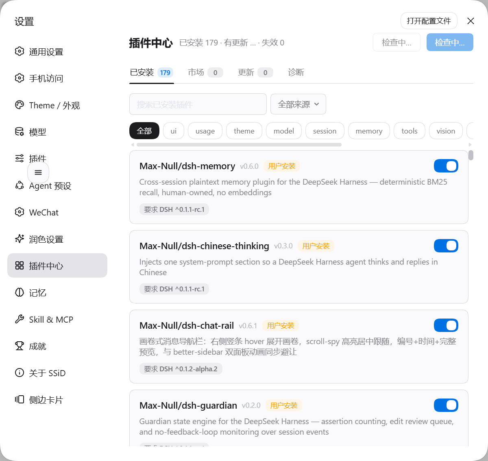
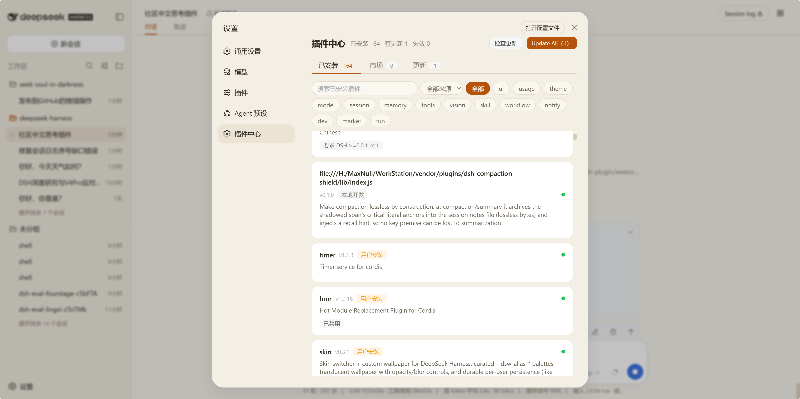
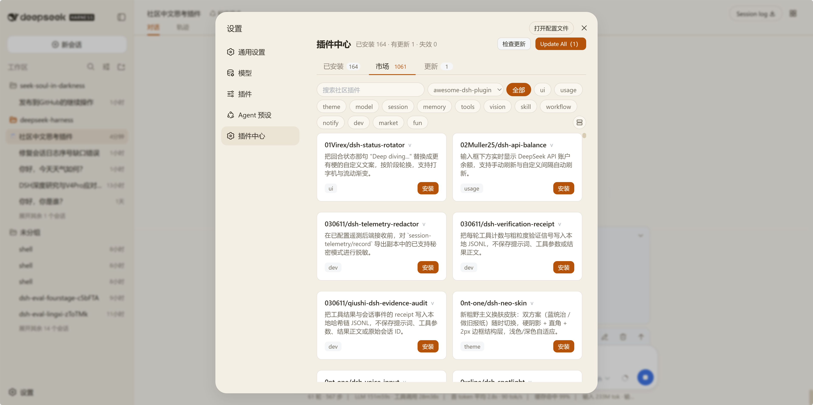
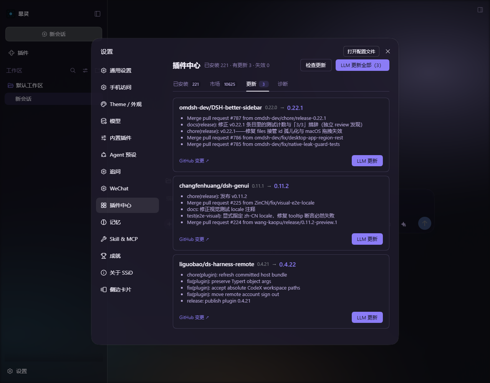

# dsh-plugin-center

This plugin belongs to the **`@max-null/*` family** — a set of plugins that together form the **[SSID (思灵 · Seek Soul in Darkness)](https://github.com/Max-Null/seek-soul-in-darkness)** desktop experience. SSID is the box that bundles them all: `dsh-capture` · `dsh-chat-rail` · `dsh-chinese-thinking` · `dsh-draft-polish` · `dsh-guardian` · `dsh-habit` · `dsh-memory` · `dsh-node-appearance` · `dsh-plugin-center` · `dsh-quick-toolbar` · `dsh-skill-mcp-center` · `dsh-ssid-panels` · `dsh-ssid-zh-ui` · `dsh-achievements` · `dsh-allostasis` · `dsh-skills` · `dsh-ssid-env` · `dsh-ssid-pwsh-retry` · `dsh-tone-layer`.

本插件属于 **`@max-null/*` 插件系列**——这一系列共同构成 **[SSID（思灵 · Seek Soul in Darkness）](https://github.com/Max-Null/seek-soul-in-darkness)** 桌面体验。SSID 是整合它们的盒：`dsh-capture` · `dsh-chat-rail` · `dsh-chinese-thinking` · `dsh-draft-polish` · `dsh-guardian` · `dsh-habit` · `dsh-memory` · `dsh-node-appearance` · `dsh-plugin-center` · `dsh-quick-toolbar` · `dsh-skill-mcp-center` · `dsh-ssid-panels` · `dsh-ssid-zh-ui` · `dsh-achievements` · `dsh-allostasis` · `dsh-skills` · `dsh-ssid-env` · `dsh-ssid-pwsh-retry` · `dsh-tone-layer`。

Plugin center for [DeepSeek Harness](https://github.com/deepseek-ai/deepseek-harness) (`dsh`) — browse, install, and update community plugins from inside the Web UI.

插件管理中心：在 DSH Web 界面里管理已安装插件、浏览社区市场、一键安装与更新。

## Features / 功能

- **Installed plugins / 已安装插件** — metadata with provenance (official / user-installed / local / builtin), categories, and DSH compatibility range.
- **Community market / 社区市场** — browse [awesome-dsh-plugin](https://github.com/awesome-dsh-plugin/awesome-dsh-plugin), [Oh-My-DSH](https://github.com/like-study1/Oh-My-DSH), and [dsh-market](https://github.com/2BingLing/dsh-market) by category, with stars and npm versions.
- **One-click install & update / 一键安装与更新** — install from the market, detect updates, update one or all.
- **What's New / 更新提示** — startup dialog listing plugins with new versions since you last looked.
- **DSH compatibility / 兼容性检查** — flags plugins whose peer range does not match the running DSH.
- **Skin-compatible / 皮肤兼容** — every color uses `var(--dsw-*)` tokens, so skin plugins restyle this UI too.
- **Packaged upgrade skill / 自带升级技能** — the `dsh-plugin-upgrade` skill ships inside this package and is served by a packaged `SkillProvider` (rank 550), so the LLM update flow can load it on a clean machine — no manual copy into `~/.dsh/skills`.

## Screenshots / 截图

装完后在设置里多出「插件中心」一项；也可从顶栏右上按钮直接打开。

**入口 / Entry：** 设置 → 插件中心（或顶栏右上按钮）

| 设置入口与面板 | 已安装 / Installed | 社区市场 / Market |
| :---: | :---: | :---: |
|  |  |  |

| 更新检测 / Updates |
| :---: |
|  |

## Install / 安装

A `dsh` installation keeps one profile per surface, and **a plugin is visible only in the profile it was installed into**. Installing into the wrong one is the usual reason an install looks like it did nothing.

`dsh` 的每种使用形态各有一个 profile，**插件装进哪个 profile，就只有那个 profile 看得见它**——「装完没反应」通常就是这个原因。

| DSH | Profile | Command |
| :--- | :--- | :--- |
| `dsh web` (CLI + browser) | `web` | `dsh plugin --profile web add @max-null/dsh-plugin-center` |
| Official desktop app / 官方桌面应用 | `desktop` | `dsh plugin --profile desktop add @max-null/dsh-plugin-center` |

From the GitHub source, replace the package name with `github:Max-Null/dsh-plugin-center`。从 GitHub 源码安装时把包名换成 `github:Max-Null/dsh-plugin-center`。

Restart DSH, then open the plugin center from the header button (top-right) or **Settings → 插件中心**. 重启 DSH 后，从顶栏右上按钮或 **设置 → 插件中心** 打开。

Requirements / 前置条件：DSH runtime within `>=0.1.1-rc.1 <0.3.0` (the `@deepseek-ai/dsh-*` peer range). A runtime outside it makes DSH skip this bundle **silently** — no error, no entry. 内核须落在 `>=0.1.1-rc.1 <0.3.0` 内；范围外 DSH 会**静默跳过**这个 bundle，不报错也不出现条目。

### Uninstall / 卸载

```sh
dsh plugin --profile <your profile> remove @max-null/dsh-plugin-center
```

### The built-in Plugins page / 官方自带的「插件」页

If the sidebar **Plugins** page shows *本部署没有可管理的 profile，无法安装或启停插件。*, that message is the DSH kernel's own and does not come from this plugin. DSH renders it whenever the host has no `pluginManager` service (`packages/boot/plugin-inventory/src/index.ts`), and that service is gated in `packages/bundle/base/cordis.patch.yml` by a single `disabled: !!js "!ctx.get('profileContext')"` row. This plugin declares `inject: ['loader']` and contributes one entry row; it neither provides nor affects `pluginManager`.

侧栏「插件」页出现 *本部署没有可管理的 profile* 时，那句话来自 DSH 内核，不是本插件。DSH 在宿主没有 `pluginManager` 服务时就会显示它，而该服务在 `packages/bundle/base/cordis.patch.yml` 里只由一行 `disabled: !!js "!ctx.get('profileContext')"` 决定。本插件声明的是 `inject: ['loader']`、只贡献一个条目行，既不提供也不影响 `pluginManager`。

Two checks / 两条自查：

1. Remove this plugin, restart, and reopen the page. **If the message is still there, this plugin was never the cause.** 卸掉本插件、重启，再看那一页——若那句话仍在，就与它无关。
2. Look in `~/.dsh/profiles/<your profile>/cordis.patch.yml` for a row that switches the manager off, and delete that row:

   ```yaml
   - id: plugin-manager
     disabled: true
   ```

   在 `~/.dsh/profiles/<你的 profile>/cordis.patch.yml` 里找有没有把管理器关掉的条目（形如上），删掉它即可恢复官方插件页。

## Development / 开发

```sh
pnpm install
pnpm build   # tsc (host) + esbuild (browser bundle)
```

## License / 许可

[MIT](./LICENSE)
