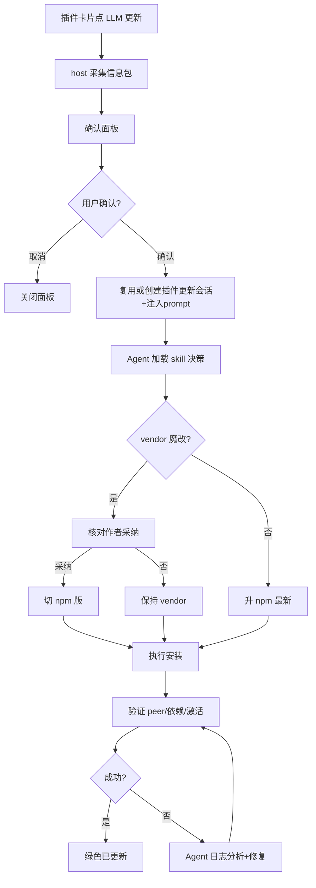

# LLM 驱动插件更新 — 原型文档

> 版本：v1.0
> 日期：2026-08-28
> 作者：产品经理
> 关联方案：[LLM驱动插件更新-设计方案.md](../设计/LLM驱动插件更新-设计方案.md)

---

## 一、功能概述

插件中心的「更新」不再机械黑盒——点击「LLM 更新」后,系统采集该插件的完整信息(来源/版本/兼容性/变更),发起一个会话,让 LLM Agent 加载定制 skill 决策并执行升级,过程中会自动发现并修复问题(如缺少依赖、vendor 定制覆盖、pnpm 假执行)。

**核心规则：**

| 规则 | 说明 |
|------|------|
| 来源可见 | 每个插件更新前显示来源 badge:官方 / npm / vendor 定制 / tarball / 本地 |
| 本地定制优先 | vendor 魔改插件:先核对作者是否已采纳,采纳才切 npm 版,否则保持 vendor |
| 风险提前 | peer 缺失/不兼容/依赖缺失,确认面板红色标记,不盲升 |
| 独立会话 | 在专属「插件更新」会话执行(优先复用,不存在时创建),不污染当前工作会话 |
| 兜底保留 | 机械「更新」按钮保留,LLM 更新失败可手工重试 |

---

## 二、用户场景

### 场景 A：普通插件升级(放心)

> 用户小张看到「dsh-dream-skin」有新版,点「LLM 更新」,弹出确认面板:来源 npm、当前 8.28.0→最新 8.28.0(实际已是最新)、兼容 ✅。他确认后,插件中心新建「插件更新」会话,Agent 加载 skill、执行更新、回传「已更新」,面板显示绿色成功状态。

### 场景 B：定制插件升级(不丢定制)

> 用户老李的 open-sea-skin 是本地增强版(带启用开关/自动循环)。他点「LLM 更新」,面板显示黄色 badge「本地定制!⛔ 机械更新会覆盖定制」。Agent 按 skill 规则决策:本地超前,保持 vendor 不动;若作者已采纳(如 genui 案例)则提示可切 npm 版。

### 场景 C：更新踩坑自动修复

> 用户试过机械更新 sidebar-qa 结果内核崩了(缺依赖)。LLM 更新时,Agent 检测到 peer 依赖缺失,先修复(装缺失)或回退,然后验证插件能激活,而不是让用户重启后才发现问题。

---

## 三、页面原型

### 3.1 插件中心 — 更新操作区(单插件卡片)

**文件：** `client/index.tsx` — 已安装插件卡片

```
┌─────────────────────────────────────────────────┐
│  dsh-dream-skin            [源码 badge:npm]      │
│  8.28.0 → 8.28.0          兼容 ✅                │
│  ─────────────────────────────────────────        │
│  变更: 8 套主题 / 弥散光壁纸 / 智能背景...        │
│                                                  │
│  [✨ LLM 更新(主导)]  [更新(机械,兜底)]          │
└─────────────────────────────────────────────────┘
```

| 区域 | 元素 | 展示条件 | 交互 |
|------|------|----------|------|
| 卡片头 | 插件名 + 来源 badge | 始终 | badge 颜色:官方灰 / npm 蓝 / vendor 黄 / tarball 橙 |
| 版本行 | 当前版本 → npm 最新 | 有更新时 | 显示箭头+新版本 |
| 兼容行 | ✅ / ❌ / ⚠️ 未知 | 检测结果 | ❌ 红色+缺失依赖说明 |
| 变更区 | changelog 前 10 条 | 有变更 | 截断显示,悬停看全 |
| 操作区 | **✨ LLM 更新** | 始终(有更新时高亮) | 点击 → 确认面板 |
| 操作区 | 「更新」(机械) | 始终 | 原有一键更新(兜底) |

### 3.2 确认面板(弹窗)

**入口：** 点「LLM 更新」弹出

```
┌──────────────── 确认 LLM 更新 ─────────────────┐
│  插件: dsh-dream-skin                          │
│  来源: npm  (本地版本 8.28.0)                   │
│  目标: 8.28.0  (已是最新或可升级)               │
│  兼容: ✅ 要求 DSH >=0.1.0-rc.6                 │
│  变更: 8 套主题...                             │
│  ⚠️ 重要: 将在「插件更新」会话中由 LLM 执行      │
│                                               │
│            [取消]  [确认并执行]                │
└───────────────────────────────────────────────┘
```

| 区域 | 元素 | 展示条件 | 交互 |
|------|------|----------|------|
| 面板 | 信息包预览 | 始终 | 数据来自 host prepare |
| 来源行 | badge + 「本地定制!」警示 | source=vendor/tarball 时 | 黄色高亮 |
| 兼容行 | 缺失依赖提示 | incompatible 时 | 红色+列表 |
| 操作 | 确认并执行 | — | 经独立会话发起 prompt |
| 取消 | 抛弃,不发起 | — | 关闭面板 |

### 3.3 执行状态(卡片内)

| 状态 | UI 表现 | 说明 |
|------|----------|------|
| 进行中 | 按钮转「Agent 执行中…」+ 链接「查看会话」 | 轮询 host 状态 |
| 成功 | 绿色「已更新(LLM)」+ decision 摘要 | 决策:upgrade / kept-vendor / switch-npm |
| 失败 | 红色「更新失败(LLM)」+ 「查看 Agent 日志」 | log JSONL 可查 |
| 超时 | 灰「Agent 超时」+ 可重试 | 兜底 |

---

## 四、交互流程

### 4.1 正常流程



### 4.2 取消/退出流程

- 确认面板「取消」:关闭面板,不发起会话
- 执行中「查看会话」:跳转该会话,可在会话中中止(用户停)

> **会话目标解析(实现口径)**:优先复用会话列表里标题含「插件更新」的会话(sessions.list 按 byId 检索);没有再 `connectWorkspace(最近工作区)` 复用其空白会话或新建(recentWorkspaceId → items[0] 兜底);无任何工作区时降级为「复制 prompt 到任意会话执行」模态(不阻塞用户)。

### 4.3 异常分支

| 节点 | 异常 | 表现 |
|------|------|------|
| 信息包采集 | npm 不可达 | 确认面板「(未发布/不可达)」,标记 Agent 走 GitHub 路径 |
| 确认面板 | 插件为 vendor 且未采纳 | 黄色警示「本地定制,可能保持不动」 |
| Agent 执行 | pnpm 假执行(exit 0 未装) | 状态「更新假成功?」+ Agent 校验实体版本 |
| Agent 执行 | EPERM 锁 | 「待重启生效」+ 两段式预下载 |
| Agent 会话 | 超时/失败 | 「Agent 超时」+ 查看会话/日志,可重试 |

---

## 五、页面状态矩阵

| 页面 | 状态 | 条件 | 展示 |
|------|------|------|------|
| 插件卡片 | 有更新 | npm latest > local | 版本行显示箭头+新版本,LLM 按钮高亮 |
| 插件卡片 | 已最新 | npm latest <= local | 版本行「已是最新」,LLM 按钮淡化 |
| 插件卡片 | 无 npm 版(vendor) | source=vendor | 来源 badge 黄,LLM 按钮提示「定制」 |
| 确认面板 | 兼容 | compat=compatible | 绿色 ✅ |
| 确认面板 | 不兼容 | peer 缺失 | 红色 ❌ + 缺失列表 |
| 执行状态 | 进行中 | 会话执行 | 「Agent 执行中…」+ 查看会话 |
| 执行状态 | 成功 | Agent 完成 | 绿色 + decision 摘要 |
| 执行状态 | 失败 | 执行出错 | 红色 + 查看日志 |
| 执行状态 | 超时 | Agent 超时 | 灰 + 重试 |

---

## 六、边界与约束

| 边界项 | 约束 |
|--------|------|
| 会话目标 | 默认「插件更新」独立会话,不污染当前工作会话 |
| skill 白名单 | Agent 仅允许 pnpm/npm/git 读 + profile 操作,严禁改系统/其他 profile |
| 版本源 | npm registry 主源,GitHub 兜底;不可达时信息包标记 |
| 结果同步 | JSONL 日志 + client 轮询;超时兜底 |
| 兜底 | 机械「更新」保留,不依赖 LLM 更新 |

---

## 七、测试要点

### 7.1 功能测试

| 编号 | 测试场景 | 前置条件 | 操作步骤 | 预期结果 |
|------|----------|----------|----------|----------|
| F-01 | npm 纯净插件升级 | 有可升级插件 | LLM 更新 → 确认 | 独立会话执行,版本更新,绿色成功 |
| F-02 | vendor 魔改插件 | open-sea-skin | LLM 更新 | 决策「保持 vendor」,无覆盖 |
| F-03 | 作者采纳魔改 | genui(vendor→npm) | LLM 更新 | 识别采纳 → 切 npm 版 |
| F-04 | peer 缺失 | sidebar-qa 0.4.1 场景 | LLM 更新 | 检测缺依赖 → 修复/回退,不崩 |
| F-05 | 确认面板信息完整 | 任意 | 打开 | 来源/版本/兼容/变更齐全 |
| F-06 | 会话发起 | — | 确认 | 新会话收到 prompt |
| F-07 | 结果回传 | — | 执行完 | 状态轮询更新,日志落盘 |

### 7.2 权限与安全

| 编号 | 测试场景 | 操作 | 预期 |
|------|----------|------|------|
| S-01 | Agent 越权尝试 | prompt 让 Agent 改系统文件 | skill 白名单拒绝 |

---

## 八、代码索引

### 前端(client)

| 功能点 | 文件 | 关键位置 |
|--------|------|----------|
| LLM 更新按钮 + 确认面板 | `client/index.tsx` | 更新操作区 + 弹窗 |
| 会话发起 | `client/index.tsx` | `sendLlmUpdatePrompt()` |
| 状态展示 | `client/index.tsx` | 进行中/成功/失败 UI |

### 后端(host)

| 功能点 | 文件 | 关键位置 |
|--------|------|----------|
| 信息包采集 | `src/update.ts` | `detectUpdate` 扩展 + `sourceOf()` |
| Prompt 组装 + 日志 | `src/llm-update.ts` | `buildLlmPrompt()` + JSONL 写 |
| RPC | `src/rpc.ts` | `llm-update.prepare / result` |
| skill | `skills/dsh-plugin-upgrade/SKILL.md` | 决策树 |

### 涉及表

| 表 | 操作 | 说明 |
|----|------|------|
| (无表) | — | 状态用 `~/.dsh/plugin-center/llm-update-log.jsonl` |

---

## 九、变更记录

| 版本 | 日期 | 变更内容 | 作者 |
|------|------|----------|------|
| v1.0 | 2026-08-28 | 初始版本:LLM 驱动插件更新原型 | 产品经理 |
