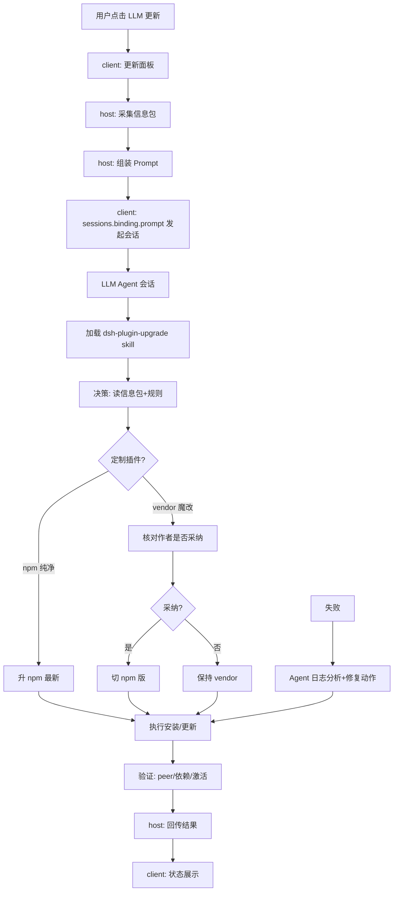
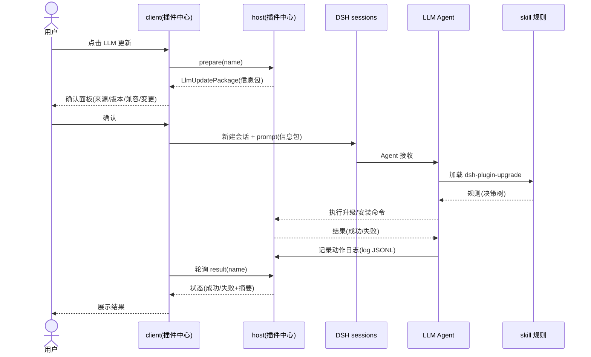

# LLM 驱动插件更新 — 功能设计方案

> 版本：v1.0
> 日期：2026-08-28
> 作者：dsh-plugin-center 团队
> 状态：待评审

---

## 一、需求背景

### 1.1 现状

dsh-plugin-center 的更新链路是**机械黑盒**:点击「更新」→ pnpm/npm 安装指定版本 → 重启生效,过程中:
- **看不到风险**:`^0.3.36` 被 pnpm 浮动解析到 0.4.x(2026-08-28 实测:ds-harness-remote `^0.3.36` → 0.4.0、dsh-better-sidebar `^0.16.1` → 0.17.1、dsh-sidebar-qa `^0.4.0` → 0.4.1 **缺 `dsh-client-ui-primitives` 依赖 → 思灵内核 DSH 启动失败**)
- **不识别定制**:SSiD 生态大量插件是**本地 vendor 魔改**(open-sea-skin 增强版、genui 模板中心/成就定制、dsh-ssid-panels 本地版),机械 `npm update` 会把 vendor 覆盖回官方版,**丢失定制**
- **无决策能力**:哪些升哪些不升、peer 兼容、作者是否采纳魔改(决定能否切 npm 版)、归档关联(SSiD 预置插件升级要同步归档)——这些判断机械更新不会做

### 1.2 用户故事

| 场景 | 用户角色 | 需求描述 |
|------|----------|----------|
| 一键更新遇到坑 | SSiD 用户 | 我点更新后插件崩了(如 sidebar-qa 0.4.1 缺依赖),希望能及时发现并修复,而不是重启后才发现 |
| 定制插件升级 | SSiD 用户 | open-sea-skin 是本地增强版,机械更新会覆盖我的定制;希望确认「本地定制 > npm」再决定 |
| 批量更新判断 | SSiD 用户 | 有好几个插件有新版,希望逐个看风险(peer/依赖/是否 vendor),由智能体帮我决策 |
| 更新失败修复 | SSiD 用户 | 更新出问题(如 EPERM 锁、pnpm 假执行)时,希望智能体读懂日志并给出修复动作 |

### 1.3 范围

| 角色 | 可操作范围 | 本次是否覆盖 |
|------|-----------|-------------|
| 用户 | 点击「更新插件」→ 预览信息包 → 确认发会话 | ✅ |
| LLM Agent | 加载 skill → 读信息包 → 决策(升/留/查作者)→ 执行 → 修复 | ✅ |
| 插件中心 host | 采集信息包(本地版本/npm 最新/peer/来源/vendor 标记) | ✅ |
| 插件中心 client | 更新按钮旁新增「LLM 更新」入口 + 结果回传展示 | ✅ |
| 机械更新 | 原有一键更新(保留为兜底) | 保留(不删除) |

---

## 二、架构设计

### 2.1 整体数据流



### 2.2 关键设计决策

| 决策点 | 选择 | 理由 |
|--------|------|------|
| 发起会话方式 | client 侧用 `sessions.binding(id).session.prompt(content, 'queue', signal)` | 实测 DSH 契约面 ISession 公开 `prompt`,无需碰 host 内部 API;可指定目标会话(新建或复用) |
| 信息包采集 | host 侧复用现有 `detectUpdate`(npm latest + changelog + compat)扩展 vendor/来源字段 | 已有基础设施,增量扩展成本低 |
| 决策落地 | 注册全局 skill `dsh-plugin-upgrade`(复用 ssid-release 升级规则) | 与社区 dsh-community-plugins 同思路(注册 skill 教 agent),但聚焦「更新决策」 |
| 定制判定 | 信息包带 `source` 字段(vendor/file:tarball/npm),skill 规则表按 source 决策 | 机械更新的痛点核心 |
| 机械更新保留 | 原有「一键更新」不删,LLM 更新为增强入口 | 用户需要兜底;LLM 更新失败可手工重试 |
| 结果回传 | host RPC 记录 Agent 动作日志 + 最终状态,client 轮询/推送展示 | 非阻塞(Agent 会话异步执行),UI 显示进行中/成功/失败 |
| 会话目标 | 默认新建会话「插件更新」,可配置复用同名会话 | 避免污染当前工作会话;独立会话便于回溯 |

---

## 三、后端设计(host 半端)

### 3.1 信息包采集 DTO

**文件：** `src/update.ts`(扩展 `UpdateDigest`)

```typescript
/** 扩展的更新信息包:在 detectUpdate 基础上补充来源/定制标记/skill 决策素材 */
export interface LlmUpdatePackage {
  name: string
  /** 当前本地版本(实体 package.json) */
  fromVersion: string
  /** npm latest(可 null=未发布/不可达) */
  toVersion: string | null
  /** GitHub commit changelog(更新前后差异) */
  changelog: string[]
  /** DSH 兼容性(peer 检查) */
  compat: 'compatible' | 'incompatible' | 'unknown'
  /** peer 声明的 DSH 版本范围 */
  compatRange: string | null
  /** 来源判定: official / npm / vendor / tarball / local-file */
  source: 'official' | 'npm' | 'vendor' | 'tarball' | 'local-file'
  /** vendor 定制标记: 是否本地魔改(对照 profile-template vendor 目录) */
  isVendorModified: boolean
  /** npm 上同包是否有更高版(判定"作者是否采纳"前提) */
  npmHasNewer: boolean
}
```

### 3.2 来源判定(新增)

**文件：** `src/update.ts` 或新增 `src/provenance.ts`

```typescript
/** 依据 profile 依赖形态判定插件来源(复用前置设计 §4.2 算法,加 vendor 细化) */
function sourceOf(specifier: string, profileDir: string): LlmUpdatePackage['source'] {
  // file:./vendor/... → vendor
  // file:./vendor/*.tgz → tarball
  // github:user/repo#ver → tarball(git)
  // ^x.y.z / x.y.z → npm
  // 本地 dev path → local-file
  // @deepseek-ai/dsh-* → official
}
```

### 3.3 组装 Prompt

**文件：** `src/llm-update.ts`(新增)

```typescript
/** 组装发给 Agent 的 prompt:角色设定 + 信息包 + 决策规则引用 */
function buildLlmPrompt(pkg: LlmUpdatePackage): string {
  return [
    '你是插件更新决策 Agent。请按 dsh-plugin-upgrade skill 规则决策并执行:',
    `插件: ${pkg.name}`,
    `当前版本: ${pkg.fromVersion} → npm 最新: ${pkg.toVersion ?? '(未发布)'}`,
    `来源: ${pkg.source}${pkg.isVendorModified ? '(本地魔改!需核对作者采纳)' : ''}`,
    `兼容性: ${pkg.compat} (要求 DSH ${pkg.compatRange ?? '未知'})`,
    `变更: ${pkg.changelog.slice(0, 10).join('; ') || '(无 changelog)'}`,
    '规则(详见 skill): 本地超前以本地为准; vendor 魔改核对 npm 是否已被作者采纳; peer/依赖缺失检查; SSiD 预置插件升级注意归档同步。',
  ].join('\n')
}
```

### 3.4 发起会话(host 编排,执行落在 client)

**说明：** prompt 发起用 **client 侧 sessions API**(见 §4.2);host 只负责采集与结果回传接口。host 半端提供:

| RPC | 方法 | 说明 |
|-----|------|------|
| `/plugin-center/llm-update.prepare` | `prepareLlmUpdate(name)` | 采集信息包,返回 `LlmUpdatePackage` |
| `/plugin-center/llm-update.result` | `getLlmUpdateResult(name)` | 读 Agent 动作日志(host 文件),返回状态 |

### 3.5 结果日志

**文件：** `~/.dsh/plugin-center/llm-update-log.jsonl`(host 追加写)

| 字段 | 说明 |
|------|------|
| `at` | 时间戳 |
| `name` | 插件名 |
| `action` | Agent 决策(upgrade/keep/switch-npm/vendor-fixed) |
| `detail` | 执行信息(命令/错误/修复动作) |
| `status` | pending/running/success/failed |

---

## 四、前端设计(client 半端)

### 4.1 更新面板改造

**文件：** `client/index.tsx`

**改造点：** 每个插件的更新区新增「LLM 更新」按钮(与机械「更新」并列):

```tsx
{/* 更新操作区: LLM 更新(主导) + 机械更新(兜底) */}
<div className="pc-update-actions">
  <Button onClick={() => onLlmUpdate(pkg)}>LLM 更新</Button>
  <Button variant="ghost" onClick={() => onUpdate(pkg)}>更新</Button>
</div>
```

点击「LLM 更新」→ host `prepare` → 弹确认面板(信息包预览:来源 badge + 版本对比 + 兼容标记 + 变更摘要)→ 确认 → 发起会话。

### 4.2 发起会话(client)

**文件：** `client/index.tsx`

```typescript
/** 复用已存在的「插件更新」会话;不存在时用 workspaces.connectWorkspace 开 blank 会话。
 *  实现对应 client/index.tsx 模块级函数(契约面已核对 dsh-client-runtime):
 *  - sessions.list 快照为 { ids, byId, current, ... }(非 items),按 byId 检索标题;
 *  - sessions.open(id) 只 open 已有会话(不创建);
 *  - 创建走 workspaces.connectWorkspace(workspaceId) → Promise<SessionId>,返回 id 由调用方 open;
 *  - workspaces 快照为 { items, recentWorkspaceId, ... },优先 recentWorkspaceId,兜底 items[0]。 */
async function ensureLlmUpdateSession(sessionsSvc: ISessions, workspacesSvc: IWorkspaces): Promise<string | null> {
  // 1) 复用列表中标题含「插件更新」的会话
  const list = sessionsSvc.list.getSnapshot()
  const existing = Object.values(list.byId).find(i => (i.displayTitle ?? '').includes('插件更新') || (i.title ?? '').includes('插件更新'))
  if (existing !== undefined) { sessionsSvc.open(existing.id); return existing.id }
  // 2) 新建:优先 recent workspace,其次第一个 workspace(无则返回 null,client 降级复制 prompt)
  const ws = workspacesSvc.list.getSnapshot()
  const wsId = ws.recentWorkspaceId ?? ws.items[0]?.id
  if (wsId === undefined) return null
  const id = await workspacesSvc.connectWorkspace(wsId)
  sessionsSvc.open(id)
  return id
}
async function sendLlmUpdatePrompt(sessionsSvc: ISessions, sessionId: string, prompt: string) {
  const session = sessionsSvc.binding(sessionId)?.session
  await session.prompt([{ type: 'text', text: prompt }], 'queue')
}
```

> prompt 由 **host** `buildLlmPrompt(pkg)` 组装并随 `LlmUpdatePackage.prompt` 返回(单一来源,client 不再手拼);批量(更新弹窗「LLM 更新全部」)时 client 以「请依次处理 N 个插件」包裹每包 prompt 注入同一会话。

### 4.3 结果展示

| 状态 | UI |
|------|-----|
| 进行中 | 按钮转「Agent 执行中…」+ 链接「查看会话」(点击跳转该会话) |
| 成功 | 绿色「已更新(LLM)」+ 摘要(decision/action) |
| 失败 | 红色「更新失败(LLM)」+ 按钮「查看 Agent 日志」 |

---

## 五、数据库变更

**无需新增表**。状态用 host JSONL 日志文件(`~/.dsh/plugin-center/llm-update-log.jsonl`),无数据库。

---

## 六、文件变更清单

### 后端(host)
| 操作 | 文件 | 说明 |
|------|------|------|
| 扩展 | `src/update.ts` | `UpdateDigest` 加 source/vendor 字段;`sourceOf()` |
| 新增 | `src/llm-update.ts` | 信息包采集 + prompt 组装 + host 结果日志 RPC |
| 新增 | `src/rpc.ts` (扩展) | llm-update.prepare / llm-update.result |
| 新增 | `skills/dsh-plugin-upgrade/SKILL.md` | 全局注册 skill(升级规则决策树) |

### 前端(client)
| 操作 | 文件 | 说明 |
|------|------|------|
| 修改 | `client/index.tsx` | 「LLM 更新」按钮 + 确认面板 + 状态展示 + 会话发起 |

---

## 七、关键流程

### 7.1 时序图



### 7.2 异常流程

| 异常场景 | client 处理 | host/Agent 处理 |
|----------|----------|----------|
| npm latest 不可达 | 确认面板标「(未发布/不可达)」,提示 LLM 更新可能只能查 GitHub | 信息包 toVersion=null,skill 转 GitHub commit 路径 |
| vendor 魔改且作者未采纳 | 确认面板黄色 badge「本地定制」 | Agent 保持 vendor,不升级(规则第一优先) |
| peer 缺失(如 sidebar-qa 0.4.1) | 确认面板红色「不兼容」+ 显示缺失依赖 | Agent 检查依赖树,修复(装缺失/回退)或报告 |
| pnpm 假执行(exit 0 未装) | 显示「更新假成功?」 | Agent 校验实体版本,不符则重试/手动命令 |
| EPERM 锁(Windows) | 显示「待重启生效」 | Agent 走两段式(pending 预下载) |
| Agent 会话失败/超时 | 显示「Agent 超时」+ 查看会话链接 | Agent 日志记录失败原因,可手动重试 |

---

## 八、测试要点

| 测试场景 | 前置条件 | 操作 | 预期结果 |
|----------|----------|------|----------|
| npm 纯净插件升级 | 有可升级 npm 插件 | LLM 更新 → 确认 → 会话执行 | 安装成功,实体版本更新 |
| vendor 魔改插件 | open-sea-skin(本地增强) | LLM 更新 | 决策「保持 vendor」,不发生覆盖 |
| 作者已采纳魔改 | genui(vendor→npm 0.9.6) | LLM 更新 | 识别「已采纳」→ 切 npm 版并删 vendor 引用 |
| peer 缺失 | sidebar-qa 0.4.1 场景 | LLM 更新 | Agent 检测缺依赖 → 修复或回退,不崩内核 |
| 信息包展示 | 任意插件 | 确认面板 | 来源/版本/兼容/变更均可见 |
| 会话发起 | — | 确认后 | 新会话「插件更新」收到 prompt |
| 结果回传 | — | 执行完 | 状态轮询更新,日志落盘 |

---

## 九、风险与边界

| 风险 | 等级 | 应对措施 |
|------|------|----------|
| LLM 误升级(漏判 vendor) | 高 | skill 规则「本地超前以本地为准」第一优先;信息包明确 source 标记;确认面板让用户始终可见 |
| LLM 会话消耗 token/时间 | 中 | 默认新建独立会话,不污染工作会话;信息包精简(changelog 截 10 条) |
| Agent 执行命令越权 | 中 | skill 白名单:仅允许 pnpm/npm/git 读+profile 操作;严禁改系统/其他 profile |
| 结果异步难同步 | 中 | JSONL 日志 + client 轮询;超时兜底提示 |
| 社区已有贴切实现 | 已消除 | dsh-community-plugins 覆盖安装发现,本设计聚焦更新决策(空白) |

---

## 十、实施计划

| 阶段 | 任务 | 预估工时 |
|------|------|----------|
| 后端 | 信息包采集扩展(sourceOf/detectUpdate)+ llm-update RPC + JSONL 日志 | 4h |
| 前端 | LLM 更新按钮 + 确认面板 + 会话发起 + 状态展示 | 4h |
| skill | dsh-plugin-upgrade SKILL.md(决策树写清:本地优先/vendor 判定/peer 检查/两段式) | 3h |
| 联调 | 端到端(真实插件升级/定制插件/失败修复各一轮) | 3h |
| 测试 | 用例编写 + 执行(§八全场景) | 3h |
| **合计** | | **17h** |

---

## 十一、变更记录

| 版本 | 日期 | 变更内容 | 作者 |
|------|------|----------|------|
| v1.0 | 2026-08-28 | 初始版本:LLM 驱动插件更新方案 | 团队 |
